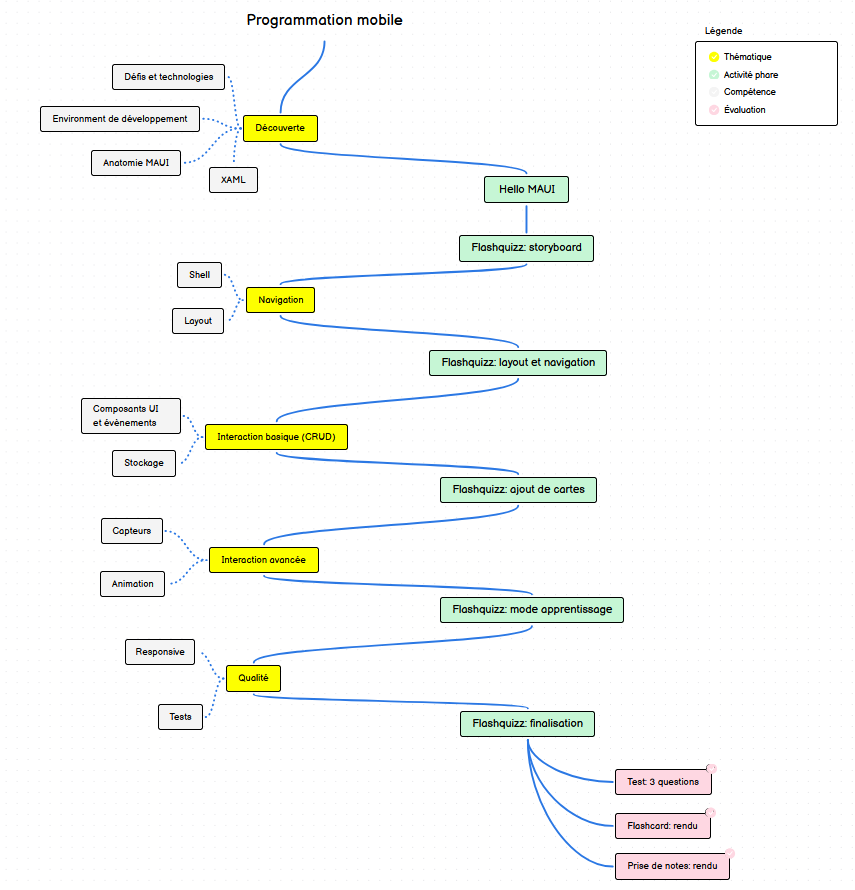

---
# https://vitepress.dev/reference/default-theme-home-page
layout: home

hero:
  name: "C-335"
  text: "Programmation mobile"
  tagline: Découvrir la programmation mobile avec MAUI
  actions:
    - theme: brand
      text: Thématiques
      link: /thematiques/README.html
    - theme: alt
      text: Évaluation
      link: /legal/evaluation.html

features:
  - title: Projets
    details: L’apprentissage au travers d’un projet concret
  - title: Langages
    details: C# (.NET)
  - title: Outils
    details: VSCommunity, Figma, Git
---

