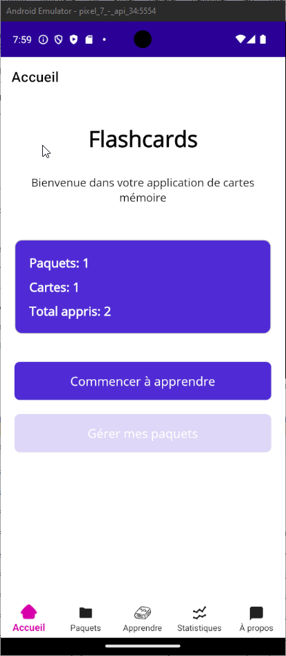

# Visage
## Reproduction

S’entraîner au layout en refaisant le visage 
du [layout](../../supports/04-layouts.pptx)

## Évènements
En lien avec la [théorie sur les évènements](../../supports/05a-evenement.md) ainsi que de [documentation officielle](https://learn.microsoft.com/en-us/dotnet/api/microsoft.maui.controls.visualelement.translationx?view=net-maui-10.0), ajouter de quoi bouger les dents:

- à gauche
- à droite
- en haut
- en bas

## Pages statiques du storyboard
Reprendre le storyboard FlashCard et implémenter un design correspondant (pas d’action, juste le design et laisser le menu pour après) :

