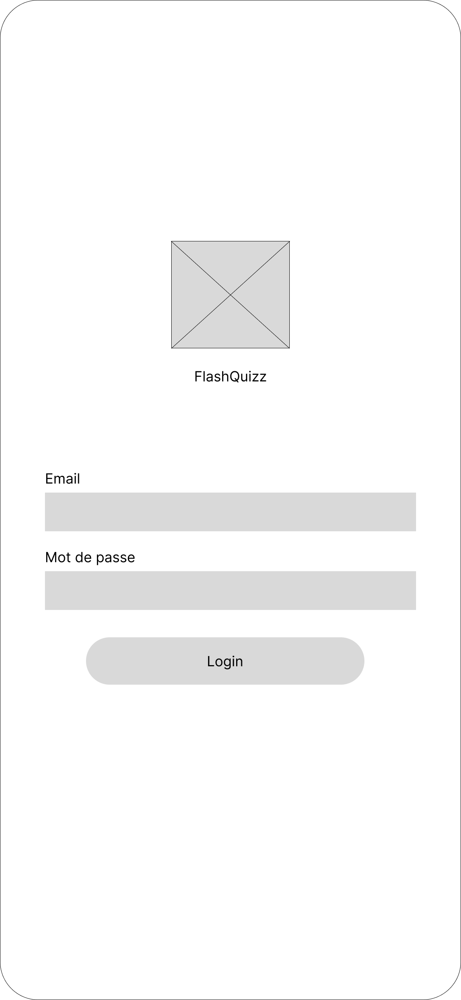
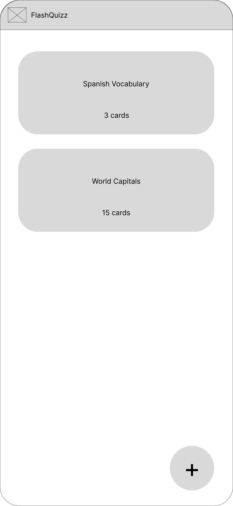
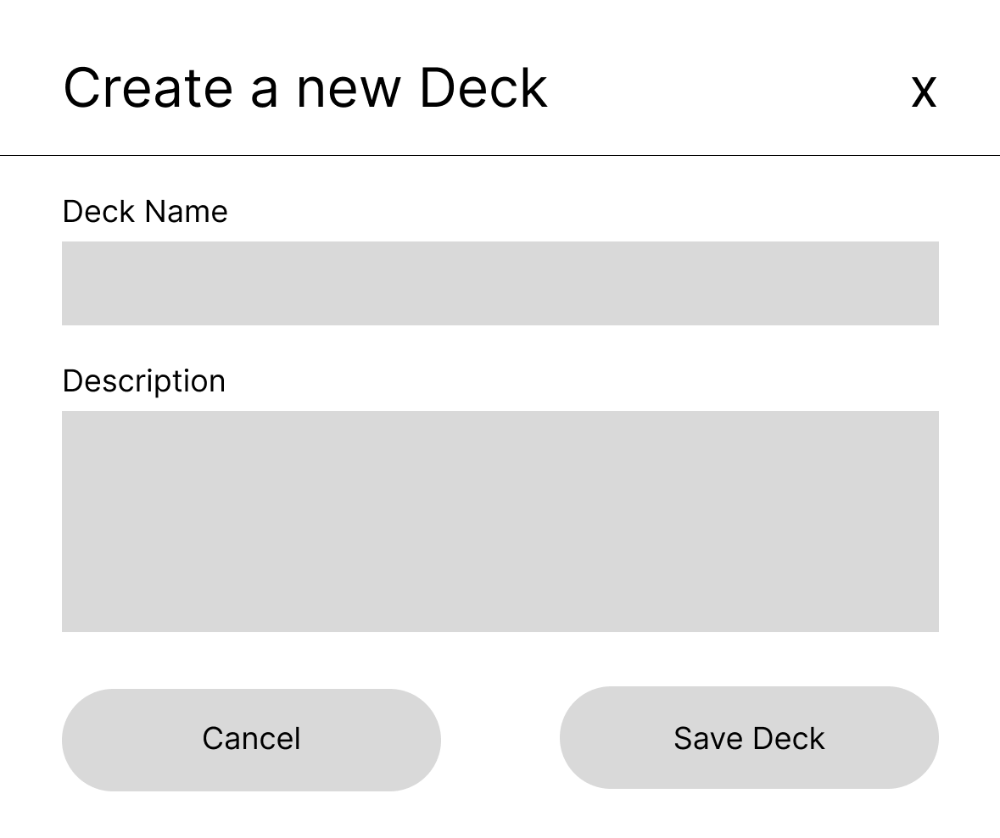
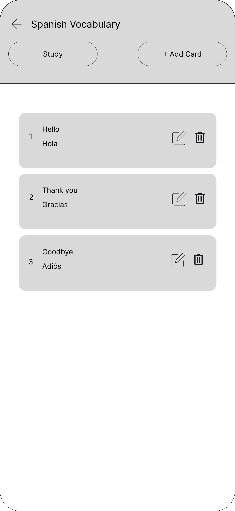
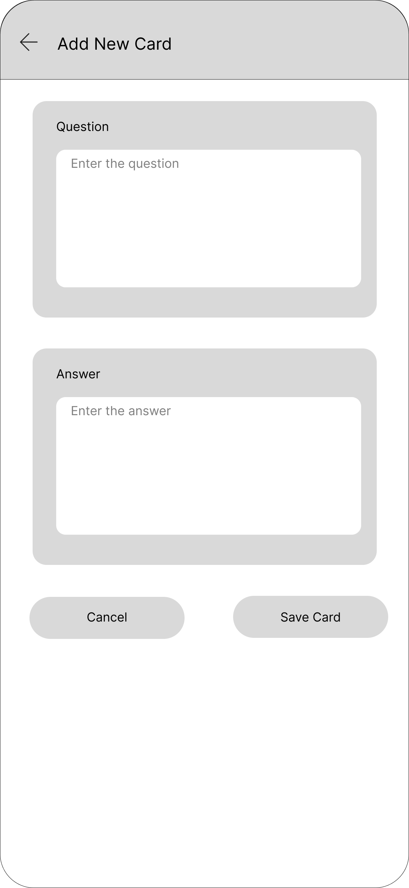
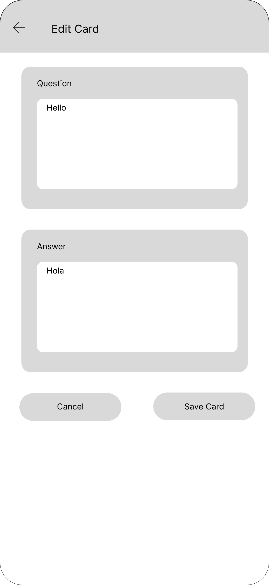
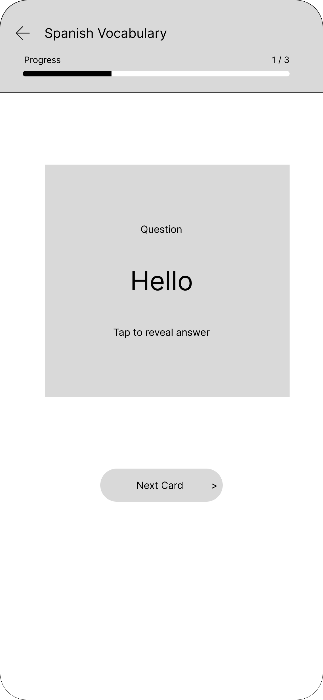
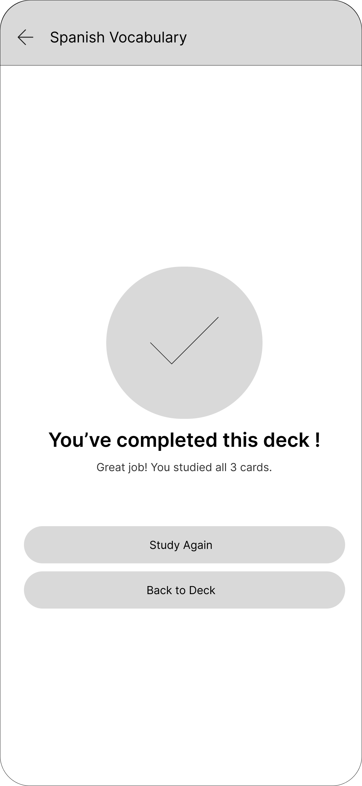

# Storyboard de l'Application Mobile FlashQuizz

**Document de Conception UX/UI**
**Date :** 15 Janvier 2026

## 1. Vue d'ensemble

Ce document structure les maquettes pour l'application FlashQuizz.

---

## Séquence 1 : Authentification et Accueil

### Écran 1 : Connexion

**Description :** Interface de connexion permettant l'accès sécurisé à l'application.

- **Action :** L'utilisateur entre ses identifiants (Email/Mot de passe).
- **Transition :** Validation réussie -> Redirection vers la **Home Page**.

### Écran 2 : Tableau de Bord (Home)

**Description :** Liste des decks existants et point d'entrée principal.

- **Action A :** Clic sur le bouton flottant **(+)** en bas à droite -> Ouvre le popup **Création de Deck**.
- **Action B :** Sélection d'un deck existant -> Ouvre **Deck Info**.

---

## Séquence 2 : Gestion des Decks

### Écran 3 : Création de Deck (Popup)

**Description :** Ce formulaire apparaît en "Bottom Sheet" (superposition) par-dessus la Home Page.

- **Action :** L'utilisateur saisit le nom du nouveau deck et valide.
- **Transition :** Le popup se ferme, la liste s'actualise sur la **Home Page**.

### Écran 4 : Vue Détail du Deck

**Description :** Résumé du deck sélectionné, statistiques d'apprentissage et options de gestion.

- **Action A :** "Étudier" -> Lance la session.
- **Action B :** "Ajouter une carte" -> Vers l'écran d'ajout.
- **Action C :** Clic sur une carte dans la liste -> Vers l'édition.

---

## Séquence 3 : Gestion des Cartes

### Écran 5 : Ajout de Carte

**Description :** Formulaire de création recto/verso.

- **Action :** Saisie de la question (Recto) et de la réponse (Verso), puis sauvegarde.
- **Transition :** Retour aux détails du deck.

### Écran 6 : Édition de Carte

**Description :** Formulaire de modification pré-rempli avec les données existantes.

- **Action :** Mise à jour du texte de la carte.
- **Transition :** Retour aux détails du deck.

---

## Séquence 4 : Session d'Étude

### Écran 7 : Interface de Révision

**Description :** Mode d'apprentissage actif.

1. La question (Recto) s'affiche.
2. L'utilisateur tape pour révéler la réponse (Verso).
3. L'utilisateur s'auto-évalue (Facile, Moyen, Difficile).

- **Transition :** Passe à la carte suivante.

### Écran 8 : Fin de Session

**Description :** Écran de félicitations une fois toutes les cartes du deck révisées.

- **Action :** Bouton pour retourner au menu principal.
