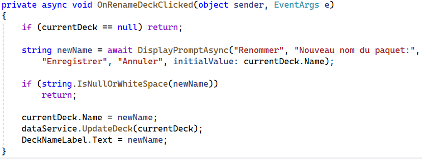

# Crud
CRUD est un mnémonique qui représente les opérations de base en lien avec la gestion d'informations numériques.

> **C** : Create (Créer / Ajouter)

> **R** : Read   (Lire / Charger)

> **U** : Update (Modifier)

> **D** : Delete (Supprimer)

## Create

### Utilisateur
Pour commencer, on aimerait ajouter une information.

Pour demander et récupérer une information donnée par l'utilisateur, par exemple, un nom de paquet de cartes, on a besoin soit

- D'un composant `Entry` 

soit

- De la fonction `DisplayPromptAsync`

#### Exemple de code avec DisplayPromptAsync


### Stockage
Une fois qu'on récupère, par exemple, le nom d'un paquet sous forme de `string`, on doit choisir quoi en faire.
Une option serait d'utiliser [une base de données](09-db.md), mais cela implique une certaine complexité et on peut déjà
réaliser une version simplifiée avec un système de `persistance` basé sur des fichiers.

#### JSON
Un format facile à gérer pour l'ordinateur et relativement digeste pour un humain est le format JSON.
Ce dernier a l'avantage d'être pris en charge nativement par .NET et pour stocker une instance de classe, il suffit
d'utiliser la classe `JsonSerializer`.

##### Exemple de code de sérialisation d'un deck


> Deux éléments importants à relever
> 1. Il pourrait y avoir des erreurs => try/catch bienvenue
> 2. Pour faciliter la lecture par un humain, l'indentation est pratique

##### Contraintes pour le json
Tant qu'on utilise des types standards, la sérialization est automatique. Ainsi, avec les éléments suivants :


Lorsqu'on `sérialise` une liste de `Deck`, on obtient, par exemple, 
après avoir ajouté 2 cartes dans un paquet, le contenu suivant :

##### Contenu JSON


## Read
Une fois les données sauvegardées en `json`,  on peut les charger de manière similaire avec le `JsonSerializer` :


> La méthode `Deserialize` doit indiquer entre chevron (<>) le type de l'objet de destination.
> Dans notre cas, une liste de `Deck` a été sérialisée, c'est donc ce type là qu'on
> souhaite.

> De nouveau, plusieurs éléments indiquent que des erreurs peuvent survenir, dans l'exemple
> le choix a été fait de protéger le tout dans un bloc try/catch, puis de vérifier l'existence
> du fichier source (FileExist), puis de créer une liste vide si le fichier était vide.


## Update
Pour la mise à jour, nous avons déjà tout ce qui est nécessaire et il suffit de modifier un élément en mémoire puis
de pérsister les éléments mis à jour :



> L'instruction `dataService.UpdateDeck(currentDeck)` fera appel à `JsonSerializer.Serialize(...)` et ainsi le fichier
> JSON sera mis à jour avec le nouveau nom du deck...

## Delete
Là aussi, rien de particulier, il suffit de supprimer un élément de la liste, puis de réécrire le fichier JSON :

```csharp
decks.RemoveAt(0); //retire le premier deck de la liste
var json = JsonSerializer.Serialize(decks, new JsonSerializerOptions { WriteIndented = true });
File.WriteAllText(decksFilePath, json);
```

### Notes sur la suppression
Il est courant de ne pas réellement supprimer les données en informatique afin de pouvoir les restaurer...

Comment réaliser cela pour que les decks restent présents tout en étant masqués en cas de suppression ?
<details>
<summary>Voir la réponse</summary>

```csharp
// Ajouter un champ à la classe Deck
public bool IsDeleted { get; set; } = false;

//Adapter la récupération des informations, par exemple
public List<Deck> GetDecks()
{
    return decks.Where(deck=>!deck.IsDeleted).ToList();
}

//Pour restaurer un deck, il suffit ensuite de modifier son attribut `IsDeleted`...
```
</details>
