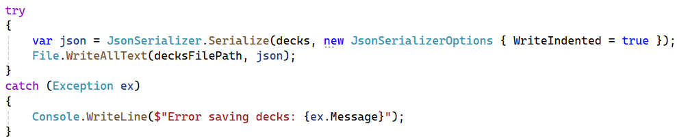
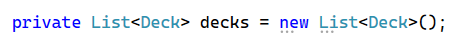
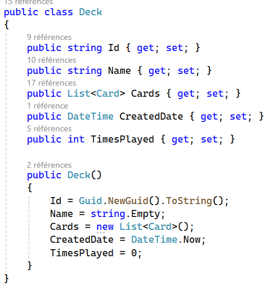
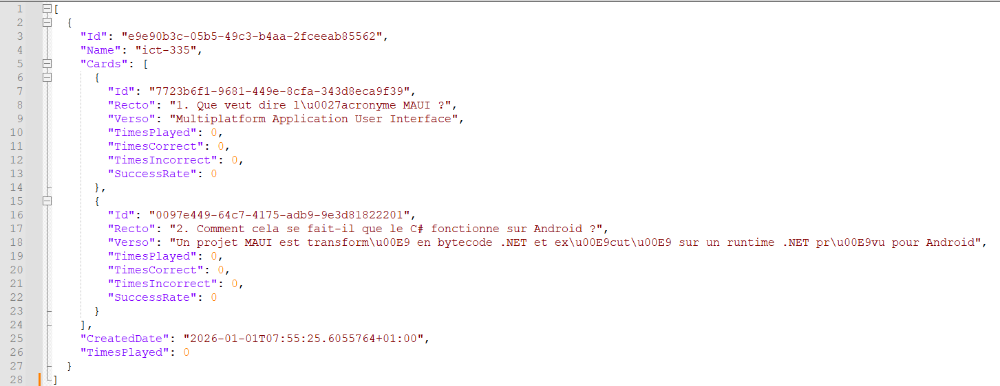

# Crud
CRUD est un mnémonique qui représente les opérations de base en lien avec la gestion d'informations numériques.

## Create

### Utilisateur
Pour commencer, on aimerait ajouter une information.

Pour demander et récupérer une information donnée par l'utilisateur, par exemple, un nom de paquet de cartes, on a besoin soit

- D'un composant `Entry` 

soit

- De la fonction `DisplayPromptAsync`

#### Exemple de code avec DisplayPromptAsync

### Stockage
Une fois qu'on récupère, par exemple, le nom d'un paquet sous forme de `string`, on doit choisir quoi en faire.
Une option serait d'utiliser une base de données, mais cela implique une certaine complexité et on peut déjà
réaliser une version simplifiée avec un système de `persistance` basée sur des fichiers.

#### JSON
Un format facile à gérer pour l'ordinateur et relativement digeste pour un humain est le format JSON.
Ce dernier a l'avantage d'être pris en charge nativement par .NET et pour stocker une instance de classe, il suffit
d'utiliser la classe `JsonSerializer`.

##### Exemple de code de sérialisation d'un deck

> Deux éléments importants à relever
> 1. Il pourrait y avoir des erreurs => try/catch bienvenue
> 2. Pour faciliter la lecture par un humain, l'indentation est pratique

##### Contraintes pour le json
Tant qu'on utilise des types standards, la sérialization est automatique. Ainsi, avec les éléments suivants:

##### Contenu du fichier
Après avoir ajouté 2 cartes dans un paquet, on pourrait avoir le json suivant:

## Read

## Update

## Delete
